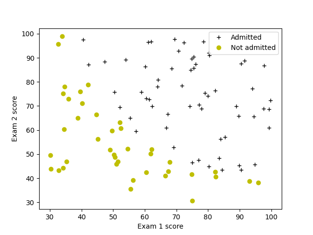
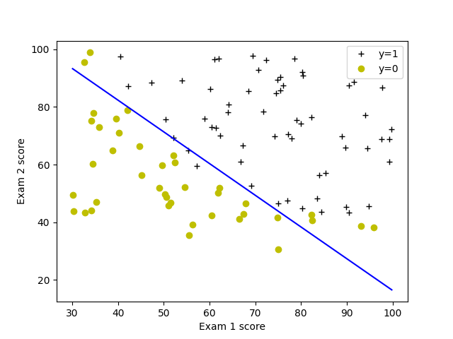
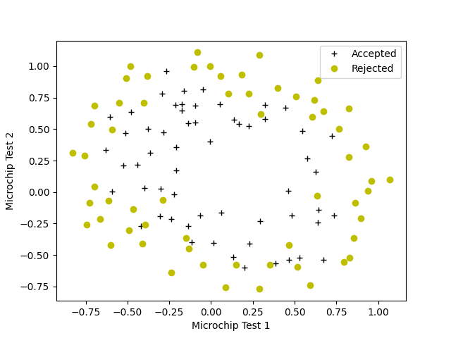
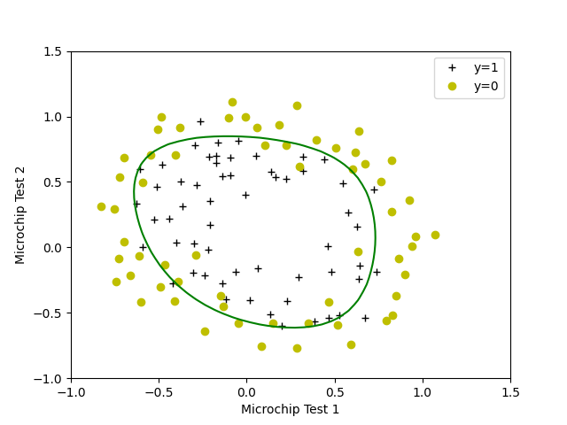

# Logistic Regression – ML Mini Project

## Problem Statement

You are acting as an admissions administrator for a university department.  
Your goal is to estimate each applicant’s probability of admission based on their scores from two exams.

You are provided with historical data from previous applicants, including:

- Exam 1 score  
- Exam 2 score  
- Admission decision (0 = rejected, 1 = admitted)

**Task:**  
Build a logistic regression model that predicts the probability of admission for a new applicant based on their exam scores.

---

## Project Description

This project implements logistic regression from scratch for two different binary classification problems.

### 1. Admission Prediction (Basic Model)

**Dataset:** `ex2data1.txt`  
Each example contains:

- Exam 1 score  
- Exam 2 score  
- Admission result (0 or 1)

**Goal:** predict whether an applicant will be admitted based on exam scores.

---

### 2. Microchip Quality Classification (Regularized Model)

**Dataset:** `ex2data2.txt`  
Each example contains:

- Microchip test 1 result  
- Microchip test 2 result  
- Label: 1 = accepted, 0 = rejected  

These data are **not linearly separable**, so the project uses:

- Polynomial feature expansion  
- L2 regularization  
- Nonlinear decision boundary plotting  

---

## Visualizations

### Basic Logistic Regression

#### 1. Input Data


#### 2. Decision Boundary


---

### Regularized Logistic Regression

#### 1. Input Data


#### 2. Decision Boundary


---

## Project Structure

```
logistic_regression_project/
│
├── data/
│   ├── ex2data1.txt
│   └── ex2data2.txt
│
├── model_basic.py
├── model_regularized.py
├── utils.py
└── README.md
```

---

## 1. Basic Logistic Regression

**File:** `model_basic.py`  
Uses dataset: `ex2data1.txt` (exam scores → admission).

Implemented from scratch:

- `sigmoid`  
- `compute_cost`  
- `compute_gradient`  
- `gradient_descent`  
- `predict`  

**Training accuracy:** ~92%.

---

## 2. Regularized Logistic Regression

**File:** `model_regularized.py`  
Uses dataset: `ex2data2.txt` (microchip test results → accepted/rejected).

Added functionality:

- Polynomial feature expansion (`map_feature()`)
- L2 regularization
- Non-linear decision boundary visualization

**Result:**  
The model avoids overfitting and separates the non-linear data correctly.

---

## Key Concepts Learned

- Logistic regression without libraries  
- Batch gradient descent  
- L2 regularization  
- Polynomial feature mapping  
- Decision boundary plotting  
- Structuring an ML project  
- Git/GitHub workflow  

---

## How to Run

```bash
python model_basic.py
python model_regularized.py
```

### Requirements

- Python 3.9+
- numpy
- matplotlib

